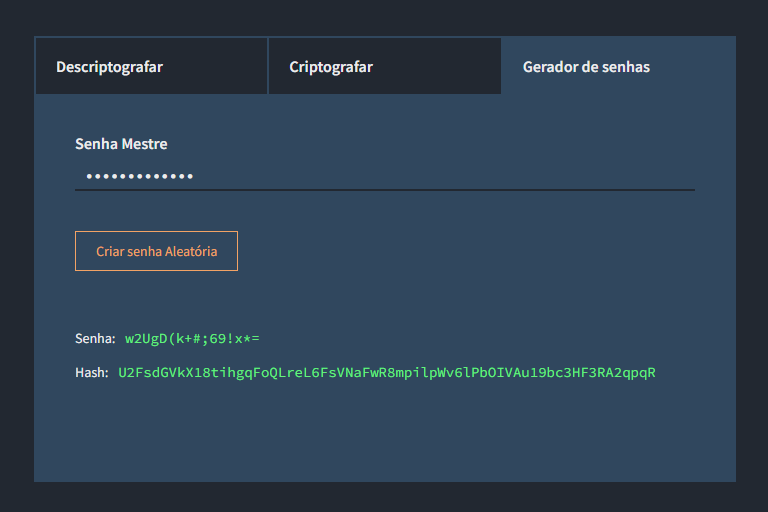

# Encrypt JS

Bem-vindo ao "Encrypt JS", uma ferramenta simples e prática para criptografar e descriptografar textos utilizando.

## Descrição

O "Encrypt JS" é uma ferramenta simples e prática para criptografar e descriptografar textos. Este projeto foi desenvolvido como forma de armazenar senhas de forma segura e prática, sem a necessidade de instalar programas adicionais ou utilizar ferramentas online.

O projeto conta com uma área de para Descriptografar a hash a partir de uma chave de criptografia, uma área para Criptografar o texto a partir de uma chave de criptografia e uma área para gerar uma senha aleatória segura e gerar uma hash a partir de uma chave de criptografia.
